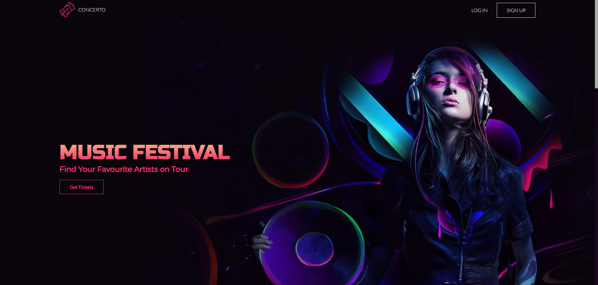

# Concerto

## Description
This full-stack project allows users to find which cities their favourite artists will perform concerts in when they go on tour. Featuring MongoDB Databases, RESTful APIs, and AWS Cloud services on the backend, while using Pug, CSS and JS for the frontend, Concerto will be sure to blow your mind and rock your ears. 

View the project live at [concertomusic.ca](http://concertomusic.ca/).

## Features
*   RESTful API featuring CRUD operations, rate limiting, data sanitization, geospacial data & filtering
    *   See the documentation at (link TBD)
*   Uses Express for path routing, middleware, and API call operations
*   Uses Mongoose for virtual populates, data indexing and data creation
*   Features JWT Cookie Token authentication, allowing users to create an account/login, upload image files (avatars) and leave comments
*   Stores and parses data (concert information, user data) in a MongoDB Atlas Database
*   Server-side HTML page and email rendering via Pug templates, delivering responsive and templatized content
*   MVC (Model-View-Controller) design pattern
*   API status codes reflecting user input
*   Deployed to an AWS EC2 Linux instance with an Elastic IP, prerouting with iptables and a registered AWS Route 53 domain

## Planned future features
*   Add email sending upon creating an account (once Amazon approves my SES request 🙏)
*   Add a 'Forgot your password?' page where users can regain access to their account via email.
*   Add an SSL certificate
*   Add an 'About' page so users understand the details of this project
*   Add add the ability to comment directly on the page with logged in users rather than strictly via the API. Will need to investigate ways of moderating this, however, before releasing this feature.

## Authors & Acknowledgements

Programming: James Treap. 
Image/asset contributions taken from [Freepik](https://www.freepik.com/).
